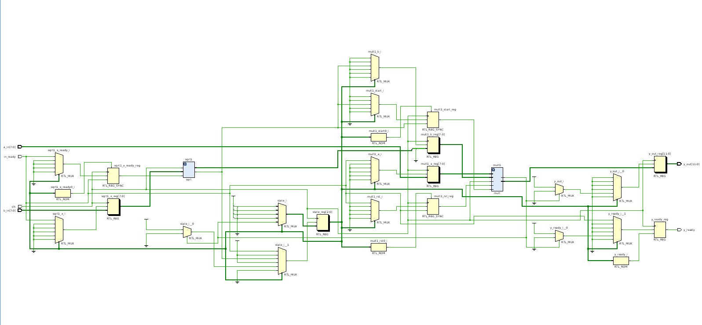
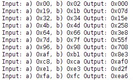
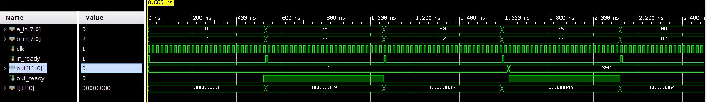

<!-- федеральное государственное автономное образовательное учреждение высшего образования
«Национальный исследовательский университет ИТМО» -->

# Лабораторная работа №1 &laquo;Функциональная схемотехника&raquo;

Выполнили студенты группы P33113:  Доморацкий Э.А., Юров М.А.

Преподаватель: Тищук Б.Ю.

Санкт-Петербург, 2021

Цель работы
=======

Получить навыки описания схем базовых операционных элементов (БОЭ) комбинационного типа на вентильном уровне с использованием языка описания аппаратуры Verilog HDL.

Вариант
=======

-   Четырехразрядный двоичный сумматор с переносом
-   Базис - NOR

Схема и ее описание
===================



Данная схема состоит из четырёх одноразрядных сумматоров, состоящих из NOR-элементов. Каждый из одноразрядных сумматоров возвращает сумму и бит переноса по следующим формулам:

```
result = ¬((a ↓ ((b ↓ ¬c) ↓ (¬b ↓ c))) ↓ (¬a ↓ ((b ↓ c) ↓ (¬b ↓ ¬c))))
carry = ¬((¬b ↓ ¬c) ↓ (¬a ↓ ((b ↓ ¬c) ↓ (¬b ↓ c))))
```


Код разработанного модуля БОЭ
==============================

`adder.v`
`adder4.v`


Код разработанного тестового окружения БОЭ
==========================================

`adder_tb.v`
`adder4_tb.v`

Описание окружения и результаты тестирования
============================================

Тесты для одноразрядного и четырёхразрядного сумматора аналогичны: в цикле перебираются все возможные наборы слагаемых (записанные в регистр in), для каждого из этих наборов вычисляется сумма и сравнивается со значением out.
Для одноразрядного сумматора в результате тестирования выводятся значения in и out, а также оповещение об успешном прохождении теста; для четырехзначного сумматора, вследствие большого числа вводимых значений, в случае провала теста выводятся значения in, out и ожидаемой суммы.

Результаты тестирования для одноразрядного сумматора:



Временная диаграмма
===================

Новые сигналы подаются с интервалом в 100 нс. При правильном прохождении теста значения in, out и счетчика i должны совпадать.




Потребление ресурсов
====================

Полученные на основе симуляции значения энергопотребления, температуры:


Вывод
=====

В результате работы были изучены основы разработки на языке Verilog HDL, при помощи которого была описана схема четырёхразрядного сумматора с переносом. При использовании среды разработки Vivado, было создано тестовое окружение, получен ряд метрик, связанных с работой описанной схемы.
